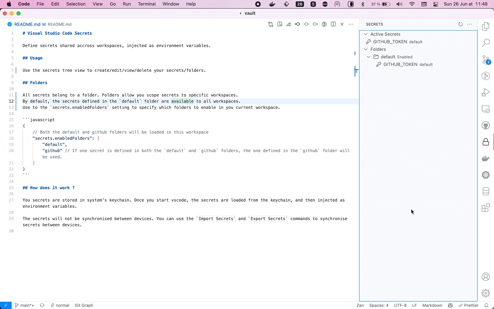

# Visual Studio Code Secrets

Define secrets shared accross workspaces, injected as environment variables.

## Usage

Use the secrets tree view to create/edit/view/delete your secrets/folders.



## Folders

All secrets belong to a folder. Folders allow you scope a set of secrets to specific workspaces.

Use the `secrets.enabledFolders` setting to specify which folders to enable specific folders in you current workspace (if you do not set it, only secrets from the `default` folder will be loaded). \
Alternatively, you can use the `enable/disable` context menu actions on the folder items in the secret explorer view.

```javascript
{
    // Both the default and github folders will be loaded in this workspace
    "secrets.enabledFolders": [
        "default",
        "github"// If one secret is defined in multiple folders, the secret from the last folder in the array will be used.
    ]
}
```

## How does it work ?

You secrets are stored in system's keychain. Once you start vscode, the secrets are loaded from the keychain, and then injected as environment variables.

The secrets will not be synchronised between devices. You can use the `Import Secrets` and `Export Secrets` commands to synchronise secrets between devices.
